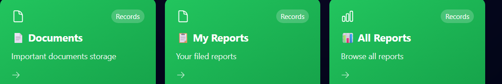

# MongoDB Database Setup - Sakhi Women Safety Project

## ✅ Status: MongoDB is FULLY INTEGRATED

Your project has complete MongoDB integration with Mongoose ODM. All data persistence is properly configured.

---

## 📋 Database Configuration

### Current Setup:
- **Database Name**: `sakhi_db`
- **Connection String**: `mongodb://localhost:27017/sakhi_db`
- **Environment Variable**: `MONGODB_URI` (in `.env` file)

### Environment Configuration (`.env` file):
```
MONGODB_URI=mongodb://localhost:27017/sakhi_db
MONGODB_URI_PROD=mongodb://production:27017/sakhi_db
```

---

## 📦 Collections & Models

All the following collections are properly configured with MongoDB:

### 1. **Users Collection**
- Stores user profiles, credentials, and preferences
- Fields: name, email, phone, password (encrypted), dateOfBirth, address, emergencyContacts, preferences
- Indexes: email, phone, safetyScore

### 2. **Emergencies Collection**
- Stores SOS alerts and emergency incidents
- Fields: userId, type, status, priority, location (GeoJSON), contactedAuthorities, recordings
- Geospatial Index: Supports location-based queries (2dsphere)

### 3. **Reports Collection**
- Stores detailed incident reports from users
- Fields: userId, type, title, description, incidentDate, evidence, status
- Supports: attachment tracking, case management

### 4. **Legal Aid Collection**
- Manages legal assistance requests
- Fields: userId, caseType, urgency, assignedLawyer, consultationDate

### 5. **Community Posts Collection**
- Social community feed and discussions
- Fields: userId, content, category, likes, comments, shares
- Features: engagement tracking, moderation status

### 6. **Notifications Collection**
- Push notifications and alerts
- Fields: userId, type, title, message, priority, channels (email, SMS, push)

### 7. **Schemes Collection**
- Government schemes and benefits database
- Fields: name, category, eligibility, benefits, applicationProcess, isActive

---

## 🚀 Installation & Setup

### Prerequisites:
1. MongoDB installed locally or connection to MongoDB Atlas
2. Node.js v18+ installed
3. Backend dependencies installed (`npm install` in backend folder)

### Step 1: Start MongoDB
```bash
# Windows
mongod

# Mac/Linux
brew services start mongodb-community
# or
mongod --dbpath /path/to/data
```

### Step 2: Configure Environment
The `.env` file in the backend folder already has MongoDB URI configured:
```
MONGODB_URI=mongodb://localhost:27017/sakhi_db
```

### Step 3: Start the Backend Server
```bash
cd backend
npm install
npm run dev
```

The server will automatically:
- Connect to MongoDB
- Initialize all model schemas
- Create indexes for performance optimization

### Step 4: (Optional) Seed Initial Data
```bash
node scripts/seedDatabase.js
```

This will populate the database with sample government schemes.

---

## 🔧 Database Connection Details

### Connection File: `backend/src/config/database.js`
- Handles MongoDB connection
- Automatic reconnection on failures
- Graceful fallback to in-memory storage if MongoDB unavailable
- Connection timeout: 5 seconds
- Socket timeout: 45 seconds

### Connection Status:
Monitor MongoDB connection in server logs:
```
✅ MongoDB Connected: localhost
✅ Server running on port 5000
```

---

## 📊 Data Storage Structure

### Example User Document:
```json
{
  "_id": "ObjectId",
  "name": "User Name",
  "email": "user@example.com",
  "phone": "9876543210",
  "password": "hashed_password",
  "role": "user",
  "emergencyContacts": [
    {
      "name": "Contact Name",
      "relationship": "Friend",
      "phone": "9876543211",
      "isPrimary": true
    }
  ],
  "address": {
    "street": "123 Main St",
    "city": "Mumbai",
    "state": "Maharashtra",
    "country": "India"
  },
  "createdAt": "2024-04-19T10:30:00Z",
  "updatedAt": "2024-04-19T10:30:00Z"
}
```

### Example Emergency Document:
```json
{
  "_id": "ObjectId",
  "userId": "ObjectId",
  "type": "sos",
  "status": "active",
  "priority": "critical",
  "location": {
    "type": "Point",
    "coordinates": [72.8479, 19.0760],
    "address": "123 Main Street, Mumbai",
    "city": "Mumbai"
  },
  "description": "Emergency situation",
  "contactedAuthorities": [
    {
      "authority": "police",
      "contactedAt": "2024-04-19T10:30:00Z"
    }
  ],
  "createdAt": "2024-04-19T10:30:00Z"
}
```

---

## 🔐 Security Features

### Password Encryption:
- Passwords are hashed using bcryptjs (12 salt rounds)
- Never stored in plaintext
- Comparison handled by Mongoose schema methods

### Data Validation:
- Email validation: RFC-compliant
- Phone: 10-digit Indian format
- Required field enforcement at schema level

### Authentication:
- JWT tokens for API authentication
- Refresh token mechanism
- Session management with Redis caching

---

## 📈 Performance Optimization

### Indexes:
- **Users**: email, phone, safetyScore
- **Emergencies**: userId, createdAt, location (geospatial)
- **Reports**: userId, status, type
- **Notifications**: userId, status

### Caching:
- Redis integration for caching frequent queries
- Cache invalidation on data updates
- Fallback in-memory caching if Redis unavailable

---

## 🛠️ Common Operations

### Create a User (Example):
```javascript
const user = await User.create({
  name: 'Jane Doe',
  email: 'jane@example.com',
  phone: '9876543210',
  password: 'secure_password'
});
```

### Create an Emergency:
```javascript
const emergency = await Emergency.create({
  userId: user._id,
  type: 'sos',
  location: {
    type: 'Point',
    coordinates: [longitude, latitude],
    address: 'Current address'
  }
});
```

### Query with Filters:
```javascript
const reports = await Report.find({
  userId: userId,
  status: 'submitted'
}).sort({ createdAt: -1 });
```

---

## 🔍 Monitoring & Debugging

### Check MongoDB Status:
```bash
# Using mongosh
mongosh mongodb://localhost:27017/sakhi_db

# List all databases
show databases

# Switch to sakhi_db
use sakhi_db

# Count documents in collections
db.users.countDocuments()
db.emergencies.countDocuments()
db.reports.countDocuments()
```

### View Server Logs:
```bash
# Terminal output shows MongoDB connection status
# Check logs/app.log for detailed information
```

---

## 🚨 Troubleshooting

### MongoDB Connection Failed:
1. Ensure MongoDB is running: `mongod`
2. Check connection string in `.env`
3. Verify port 27017 is not blocked by firewall
4. Check if localhost:27017 is accessible: `netstat -an | grep 27017`

### Data Not Persisting:
1. Verify `MONGODB_URI` is correct
2. Check MongoDB logs for errors
3. Ensure database user has write permissions
4. Clear browser cache and refresh

### Performance Issues:
1. Create indexes as defined in models
2. Enable caching with Redis
3. Optimize queries with projections
4. Monitor database size and connections

---

## 📚 API Endpoints Using MongoDB

### Authentication:
- `POST /api/auth/register` - Create new user
- `POST /api/auth/login` - User authentication
- `POST /api/auth/refresh` - Refresh JWT token

### Emergency:
- `POST /api/emergency/sos` - Trigger SOS alert
- `GET /api/emergency/:id` - Get emergency details
- `PUT /api/emergency/:id/status` - Update status

### Reports:
- `POST /api/reports` - File a report
- `GET /api/reports/my-reports` - User's reports
- `GET /api/reports/:id` - Get report details

### Community:
- `POST /api/community/posts` - Create post
- `GET /api/community/posts` - Get community feed
- `POST /api/community/posts/:id/like` - Like a post

### Benefits:
- `GET /api/benefits/schemes` - All government schemes
- `GET /api/benefits/recommendations` - Personalized schemes

---

## 📞 Support & Resources

### MongoDB Documentation:
- https://docs.mongodb.com/
- https://docs.mongodb.com/drivers/node/

### Mongoose Documentation:
- https://mongoosejs.com/docs/

### Connection Tips:
- Use MongoDB Atlas for cloud deployment
- Use connection pooling for better performance
- Regular backups essential for production

---

## ✨ Next Steps

1. **Development**: Test all features locally with MongoDB
2. **Testing**: Run test suite: `npm run test`
3. **Production**: Configure MongoDB Atlas cluster
4. **Backup**: Set up automated MongoDB backups
5. **Monitoring**: Monitor database performance and size

---

**Status**: ✅ MongoDB fully integrated and ready to use!
**Last Updated**: April 19, 2024
